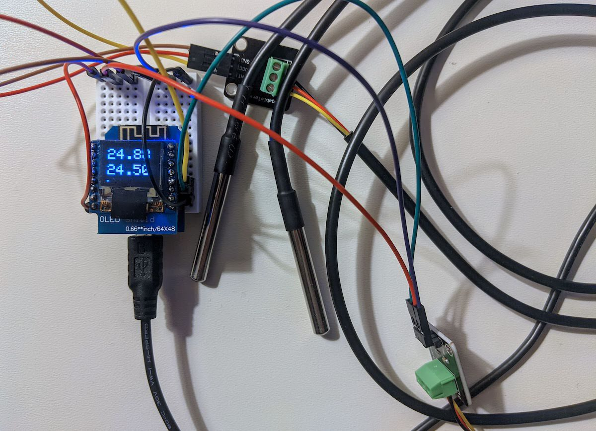

### Two temperature sensors with WiFi

  Client for [temperature sensors](https://github.com/olegnet/iot-data-server) project

#### Devices

  * [D1 mini board](https://aliexpress.com/item/32651747570.html)
  * [64x48 OLED screen](https://aliexpress.com/item/32800979738.html)
  * [DS18B20 temperature sensor](https://aliexpress.com/item/4000143479592.html)

#### Platformio libraries

```sh
pio lib install "adafruit/Adafruit GFX Library"
pio lib install "paulstoffregen/OneWire"
pio lib install "milesburton/DallasTemperature"
pio lib install "adafruit/Adafruit BusIO"
pio lib install "stblassitude/Adafruit SSD1306 Wemos Mini OLED"
```

#### wifi-credentials.h content

```c++
#define WIFI_SSID "access point name"
#define WIFI_PASS "access point password"
```

  host and port to upload data

```c++
#define SERVER_HOST "192.168.1.100" 
#define SERVER_PORT 12345
```

#### Dirty hack to make CLion happy

Code navigation doesn't work in my CLion 2021.2.2 without it

```c++
#include "../.pio/libdeps/d1_mini/Adafruit GFX Library/Adafruit_GFX.h"
#include "../.pio/libdeps/d1_mini/Adafruit SSD1306 Wemos Mini OLED/Adafruit_SSD1306.h"
#include "../.pio/libdeps/d1_mini/OneWire/OneWire.h"
#include "../.pio/libdeps/d1_mini/DallasTemperature/DallasTemperature.h"
```

#### TODO

  * Better UI for WiFi status
  * Upload temperature data to the server
  * Battery monitoring
  * Soldering and boxing

#### Development version

  
